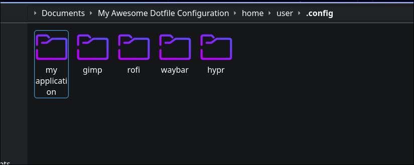
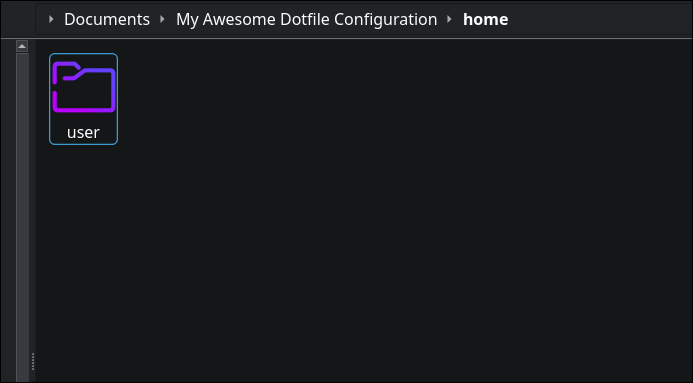
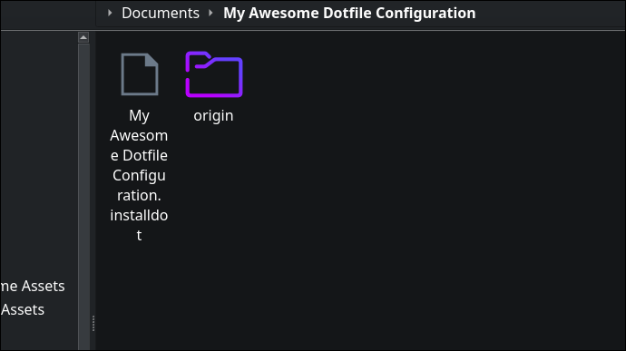

<!-- <div align="center"> -->


<!-- </div> -->
# Arch Installer (With dotfiles)
[](https://github.com/archlinux/archinstall/actions/workflows/flake8.yaml)

### A fork of [archinstall](https://github.com/archlinux/archinstall) that provides options to automaticilly install dotfiles from a repository, file, or our library.

## Installing on a Live CD
### Installing is pretty straight forward.
Assuming you already have internet set up, installing Git is the first thing you need to do.

```sudo pacman -S git``` This installs Git using pacman for arch.

Then, clone the repository.

```git clone https://github.com/NoSleepKid/archinstall-dotfiles``` This uses Git to download the contents of the package.

Then, CD into the folder.

```cd archinstall-dotfiles``` This uses the CD command to change your working directory to the folder.

Finally, run the command to install it, then run the guided installer.

```makepkg -si``` This copies the files to where it needs to be so you can run it easily.

```archinstall-dotfiles``` This executes the guided installer.

And now from there, It is pretty simple to install Arch Linux from there.

## Installing on an existing system

### It is easier than ever to install the installer package on an existing system.

Make sure you have [yay](https://github.com/Jguer/yay) installed on your system to perform the installation.

If you do not have [yay](https://github.com/Jguer/yay) installed, follow the Installing on a Live CD setup.

Install archinstall-dotfiles using the following command:

```yay -S archinstall-dotfiles``` This uses the [yay](https://github.com/Jguer/yay) package manager to install the package.

Now you are finished! I'm not joking when we say it is easier than ever.

```archinstall-dotfiles``` This executes the installer so you can install customiszed arch on your computer!

## Making your own dotfile setup

### To make your own dotfile that is able to be installed with the guided installer, You need to install the installer on an already existing install of Arch Linux, So if you have not installed archinstall-dotfiles, Follow the installation guide just a couple sections up.

You should already have the files set up in a configuration. Just like this:



#### Make sure the ```/home/[USER]``` directory has ```user``` as the actual user directory. Just like this:



Use ```archinstall-dotfiles``` command to make the file.

```archinstall-dotfiles --make [PATH]``` This makes use of the installed installer to make the file.

#### Make sure you replace ```[PATH]``` with your actual path of the folder, in this case, it is ```/home/sleep/Documents/My Awesome Dotfile Configuration```.

Once the command has ran, And the returned output said it completed sucessfully, this is what the directory should look like:

#### Inside of origin should be the original files the file was made with. And a ```.installdot``` file should be named. This is your completed file.



Now you are done, you can now publish that, or use it as is.
